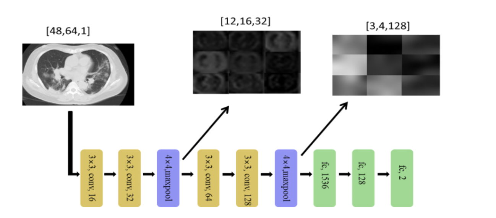

# paper

 Environment: TensorFlow_cpu_1.15_cp37; Python 3.6

Database: We have 397 normal CT images; 349 COVID-19 images; 1349 normal X-ray images; 1345 virus images and 2538 bacteria images.

The basic CNN model with a residual structure is like this:

Then, we used transfer learning to transfer the parameters in X-ray images to CT images; self-supervised learning to enlarge the training set, and multi-task learning to train whether they are COVID and rotated images.
